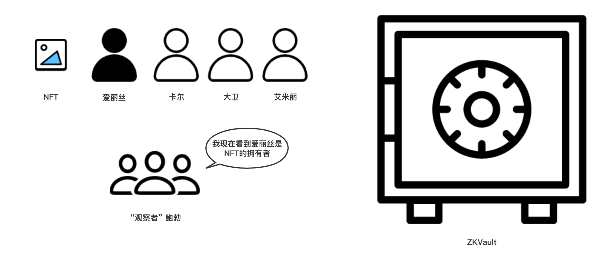

# ZKVault剧场

下面我们通过ZKVault剧场来介绍ZKVault的基本功能。

# 登场人物介绍

* 爱丽丝: NFT的拥有者, 但是她一直在为她的隐私而担忧，她不想泄露她所持有的NFT的相关信息。

* “观察者”鲍勃：他一直密切地关注者区块链，他看到任何有趣的事情都会喃喃自语（所以我们也会知道他到底在想些什么！）。

* 卡尔 / 大卫 / 艾米丽：他们不是NFT的拥有者，爱丽丝认识他们，并且会和他们展开一段故事。

* ZKVault: NFT的保管箱，它会尽其所能保护用户的隐私：）
