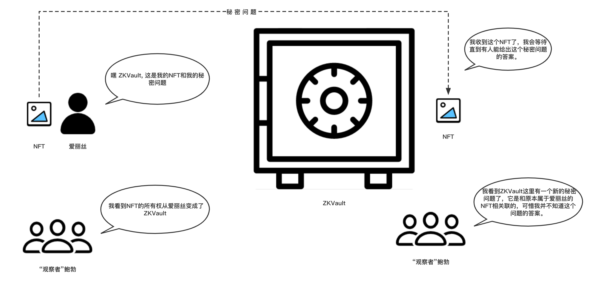

# ZKVault剧场 - 第一幕 - 存入NFT

爱丽丝想要把NFT存入ZKVault。

"观察者"鲍勃（喃喃自语）：我一直看着区块链，区块链显示爱丽丝是这个NFT的拥有者。

爱丽丝（一边将NFT递给ZKVault一边说）: 嘿ZKVault, 帮我保管好这个NFT，还有，这是我的秘密问题。

ZKVault（小心地收好NFT）：放心吧，我会妥善的保管好这个NFT的。别忘了我们的规则：只有能正确提供这个秘密问题的答案的人才能拿走它。

“观察者”鲍勃（睁大了眼睛，兴奋地）：看呐，那个NFT现在归ZKVault所有了！还有那个关联的秘密问题！不过，我并不知道这个秘密问题的答案是什么......

（第一幕结束）