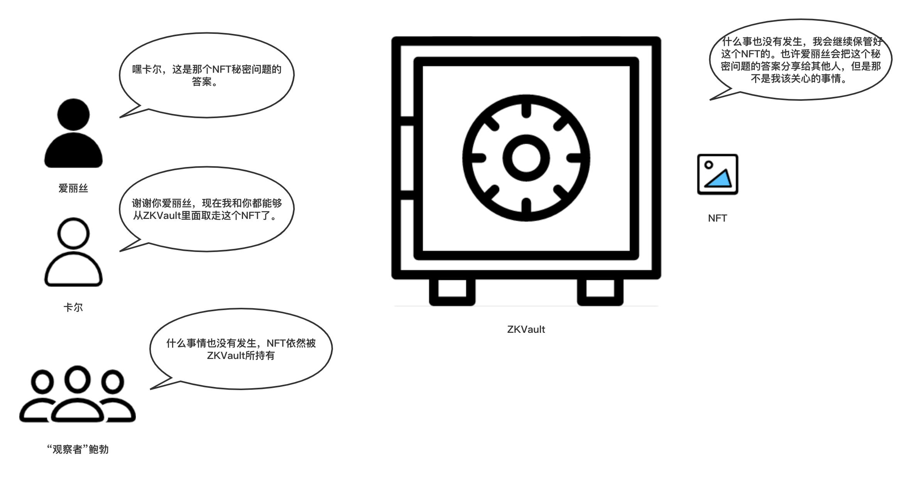

# ZKVault剧场 - 第二幕 - NFT所有权的隐秘分享

爱丽丝想要偷偷地和卡尔分享这个NFT的所有权。

"观察者"鲍勃（喃喃自语）：我一直看着区块链，自从NFT被转给ZKVault了之后什么事情也没有发生。

爱丽丝（偷偷地和卡尔说）: 嘿卡尔, 这是那个NFT秘密问题的答案，现在你也知道了。

卡尔（仔细地记下答案）：谢谢你爱丽丝，现在我和你都可以从ZKVault里面取走这个NFT了。

ZKVault：什么事也没有发生，我会继续保管好这个NFT的。也许爱丽丝会把这个秘密问题的答案分享给别人，但是那不是我应该关心的问题。

（第二幕结束）