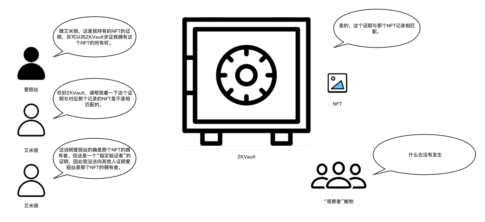

# ZKVault剧场 - 第三幕 - NFT所有权的隐秘证明

爱丽丝想要偷偷地向艾米丽证明自己是那个NFT的拥有者，虽然它看起来是被ZKVault持有的。

爱丽丝（私下与艾米丽进行沟通）: 嘿艾米丽, 这是我持有那个NFT的证明，你可以向ZKVault验证这件事。

艾米丽（通过隐秘的渠道向ZKVault打听）：你好ZKVault，请帮我验证这个证明与那条NFT记录是否相匹配。

ZKVault（仔细检查了一番这个证明，并向艾米丽回复）：是的，我可以确认这个证明与那条NFT记录相匹配。

艾米丽（内心独白）：现在我确定爱丽丝是那个NFT的拥有者没错了。可惜这是一个"指定验证者"的证明，我没法让别人相信爱丽丝是那个NFT的拥有者。

"观察者"鲍勃（双眼无神）：区块链上什么事情也没有发生。

（第三幕结束）