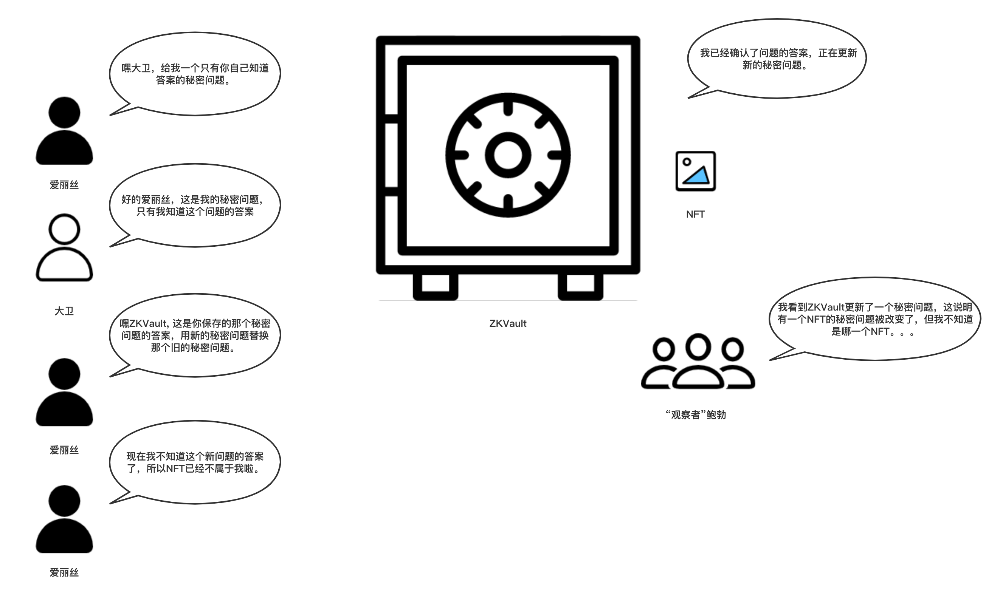

# ZKVault剧场 - 第四幕 - NFT所有权的隐秘转移

爱丽丝想要偷偷地把NFT的所有权转移给大卫。

爱丽丝（偷偷地和大卫说）: 嘿大卫, 给我一个只有你知道答案的秘密问题。

大卫（默默地构思了一个问题，偷偷地回复爱丽丝）：好的爱丽丝，这是我的秘密问题，只有我自己知道这个问题的答案。

爱丽丝（对ZKVault说）：嘿ZKVault，这是你目前保存的那个秘密问题的答案，用新的秘密问题替换掉那个旧的问题。

ZKVault：我已经确认了这个答案是正确的，我现在马上用这个新的秘密问题与那个NFT进行关联。

爱丽丝（自言自语道）：现在我不知道这个新问题的答案了，所以那个NFT已经不属于我啦。

"观察者"鲍勃（满脸狐疑地）：我看到ZKVault保存了一个新的秘密问题，这说明某一个NFT的所有权被隐秘地转移了，可惜我并不知道是哪一个NFT......

（第四幕结束）