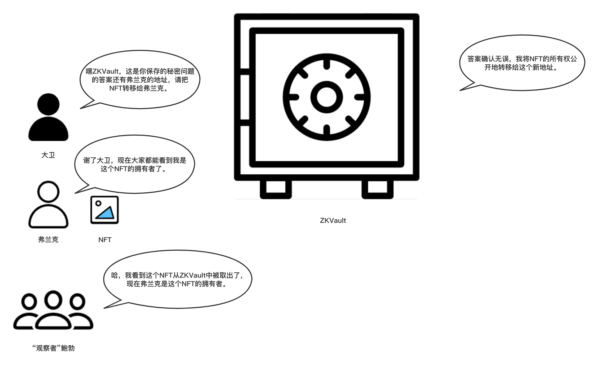

# ZKVault剧场 - 第五幕 - NFT所有权的公开转移（取出）

大卫想要公开地把NFT的所有权转移给弗兰克。

大卫（对ZKVault说）: 嘿ZKVault, 这是你保存的秘密问题的答案，还有这是弗兰克的钱包地址，请把对应记录的NFT转移给弗兰克。

ZKVault：答案确认无误，现在我将这个NFT的所有权公开地转移给你提供给我的地址。

弗兰克（接过从ZKVault转移来的NFT）：谢了大卫，现在大家都知道我是这个NFT的拥有者了。

"观察者"鲍勃（又一次兴奋起来）：哈！我看到这个NFT从ZKVault中被取出了，现在弗兰克是这个NFT的拥有者了。

（剧终）